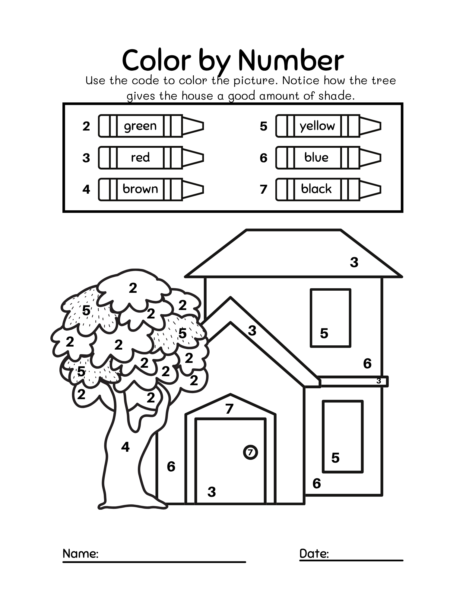
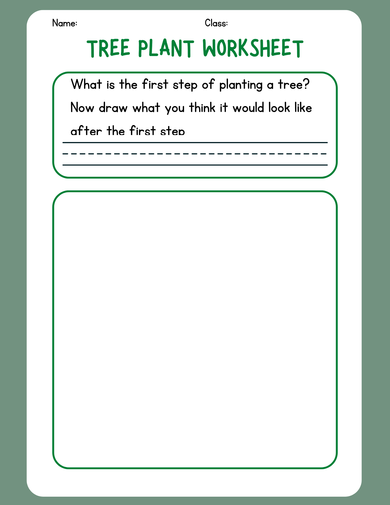

---
hide:
  - navigation
---

# Activities

<figure markdown="span">
  { width="300" }
  <figcaption>Image caption</figcaption>
</figure>

<figure markdown="span">
  { width="300" }  
  <figcaption>Image caption</figcaption>
</figure>

